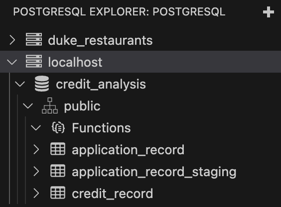
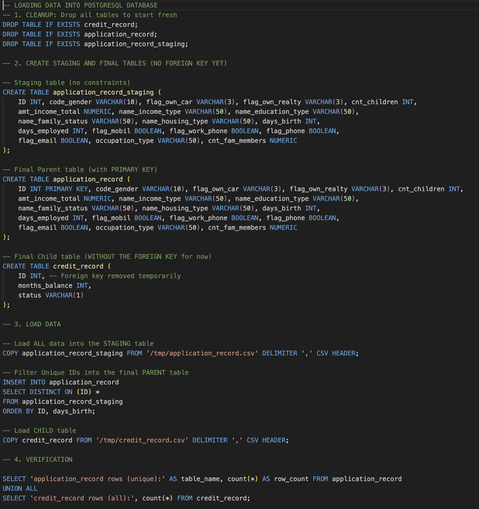
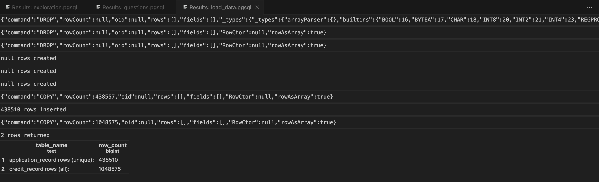
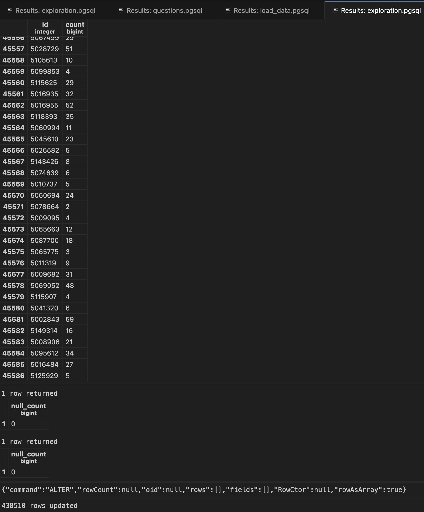
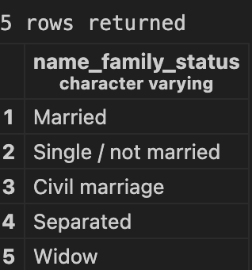
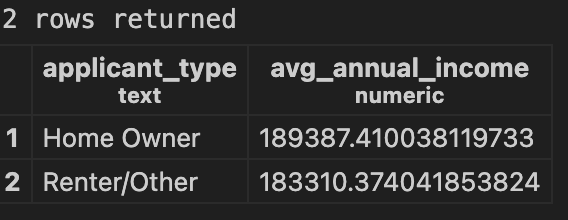
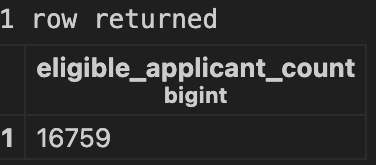
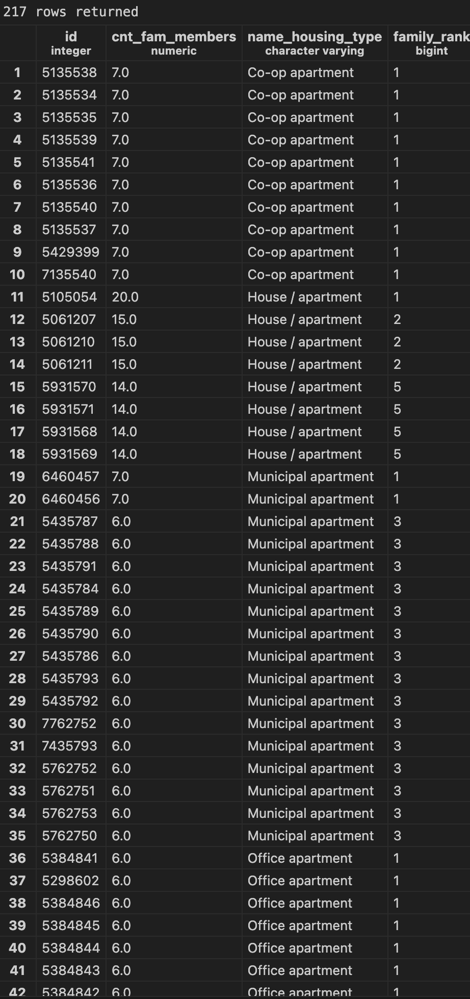
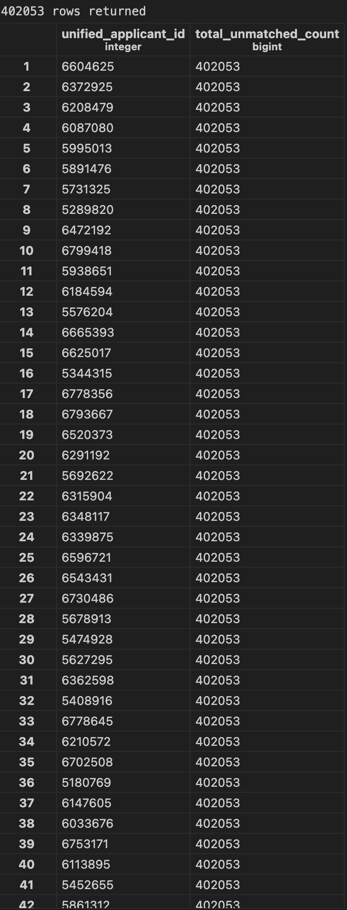

# SQL Guidebook

## Project Description 
This project serves as a personalized SQL reference guide, demonstrating proficiency in core and advanced PostgreSQL features. The goal is to analyze credit applicant demographics against their monthly credit history records to derive risk-based insights, satisfying requirements for advanced joining, window functions, CTEs, and data cleaning/transformation.

## Dataset Overview
This project utilizes the [Credit Card Approval Prediction](https://www.kaggle.com/datasets/rikdifos/credit-card-approval-prediction) dataset from Kaggle, which includes two tables: `application_record.csv` and `credit_record.csv`. This dataset links applicant demographics with their monthly credit account status, and captures various aspects of financial history and client background. More about the dataset tables below: 
- `application_record.csv`: Provides core applicant demographics, including annual income, education type, family status, housing type, and calculated age.
- `credit_record.csv`: Provides detailed monthly credit history for each applicant, containing the month-since-application and the applicant's credit status code for that month.

## Step-by-Step Instructions 
### PostgreSQL Environment Set-Up
The project was executed using a locally hosted PostgreSQL server managed via the VS Code PostgreSQL Explorer extension.
- Initial Connection: The extension was used to connect to the local server as the postgres user and establish the connection to the working database, `credit_analysis`. 

- Query Execution Context: When running queries from the editor, the connection context was often reset by manually re-establishing the active database by clicking on the `credit-analysis` to reconnect. 

### Table Creation & Data Loading
The following code was executed in a single script to perform cleanup, define the schema, manage duplicates, and load the final data from the CSV files (also in `load_data.pgsql`): 


#### Design Highlights
- Normalization: The schema uses a one-to-many relationship, separating applicant demographics (static data) from monthly credit status (temporal data) to adhere to normalization principles.
- Entity Uniqueness: `ID INT PRIMARY KEY` on `application_record` enforces uniqueness for each applicant.
- Staging Strategy: The application_record_staging table was deliberately created without a Primary Key to ingest "dirty data" (duplicate IDs) before filtering. In other words, I created a staging table (`application_record_staging`) to manage and correct the flaw of the source file containing duplicate Primary Key (ID) values. As such, the staging table was created without the PRIMARY KEY constraint, allowing it to serve as a temporary holding area that accepted all raw data (including the duplicates) without failing the `COPY` operation. This enabled the step of using the `INSERT INTO ... SELECT DISTINCT ON (ID)` query to filter the raw data and load only the valid, unique primary key records into the final, constrained `application_record` table.
- Data Types: Appropriate types were used: `NUMERIC` for income, `INT` for counts, and `BOOLEAN` for flags, ensuring data integrity at the column level.
- Constraint Management: The Foreign Key constraint was temporarily omitted from `credit_record` during the load to successfully manage records filtered out during the staging process, avoiding integrity errors.

Here is the final result of `load_data.pgsql`: 


### Data Exploration & Transformation
This step focused on data quality, validating relationships, and feature engineering before tackling the final analytical queries.
1. Data Quality Checks
Validation queries confirmed the success of the loading strategy and verified the data structure:
- Duplicate Check: Confirmed no duplicates in the `application_record` (parent) table, validating the staging process. It correctly returned 45,586 duplicate IDs in the credit_record (child) table, confirming the expected one-to-many relationship.
- Null Check: Verified that no NULL values were present in the key columns of either table.

2. Transformation and Feature Engineering
A new feature, age in years, was engineered from the raw days_birth column using the `UPDATE` command.
```
ALTER TABLE application_record ADD COLUMN age_years INT;
Populate Age Column:

SQL

UPDATE application_record
SET age_years = ABS(days_birth) / 365;
```
This demonstrated the use of UPDATE and numerical functions for efficient data preparation. Below is a sample screenshot of the results from `exploration.pgsql`: 


## Questions & Analysis 
1. What are the five most common family statuses among applicants who currently have a recorded credit status of '0' (Current/Good standing)?
```
SELECT name_family_status
FROM application_record
WHERE ID IN (
    SELECT DISTINCT ID
    FROM credit_record
    WHERE status = '0'
)
GROUP BY name_family_status
ORDER BY COUNT(*) DESC
LIMIT 5;
```
Results (also included in [text](results/1_five_common_family_status.csv)): 


2. What is the average annual income for applicants classified as 'Home Owner' or 'Renter/Other'? Display only those groups where the average income exceeds $150,000. 
```
SELECT
    CASE 
        WHEN flag_own_realty = 'Y' THEN 'Home Owner'
        WHEN flag_own_realty = 'N' THEN 'Renter/Other'
        ELSE 'Unknown'
    END AS applicant_type,
    AVG(amt_income_total) AS avg_annual_income
FROM application_record
GROUP BY applicant_type
HAVING AVG(amt_income_total) > 150000;
```
Results (also included in [text](results/2_applicant_type.csv)): 


3. How many applicants are both under 30 years old AND have been employed for less than two years (ABS(days_employed) < 730)?
``` 
-- With a CTE
WITH ApplicantAge AS (
    SELECT
        ID,
        days_employed,
        ROUND(ABS(days_birth) / 365) AS age_years 
    FROM
        application_record
)
SELECT
    COUNT(ID) AS eligible_applicant_count
FROM
    ApplicantAge
WHERE
    age_years < 30                    
    AND ABS(days_employed) < 730;       
-- Without a CTE because I created 'age_years' column in exploration.pgsql
SELECT COUNT(*)
FROM application_record
WHERE age_years < 30 AND ABS(days_employed) < 730;
```
Results (also included in [text](results/3eligible_applicant_count.csv)): 


4. What is the rank of each applicant based on their number of family members (cnt_fam_members)? Display only the rows corresponding to the top 5 families in each housing type. 
```
WITH applicant_rank AS (
    SELECT 
    ID, 
    cnt_fam_members,
    name_housing_type,
    RANK() OVER (
        PARTITION BY name_housing_type
        ORDER BY cnt_fam_members DESC
    ) AS family_rank
    FROM application_record
)
SELECT 
    ID, 
    cnt_fam_members,
    name_housing_type,
    family_rank
FROM applicant_rank
WHERE family_rank <= 5
ORDER BY name_housing_type, family_rank; 
```
Results (also included in [text](results/4family_rank.csv)): 


5. What was the credit status of each applicant three month before their current record date? Display the results ordered by applicant and their timeline. 
```
SELECT
    ID,
    months_balance,
    status AS current_status,
    LAG(status, 3, 'N/A') OVER (
        PARTITION BY ID
        ORDER BY months_balance
    ) AS status_3_months_ago
FROM
    credit_record
ORDER BY
    ID, months_balance;
```
Results are shown in [text](results/5credit_status_3m.csv). 

6. Which applicants lack any credit history? 
```
SELECT
    COALESCE(t1.ID, t2.ID) AS unified_applicant_id,
    (
        SELECT COUNT(app.ID)
        FROM application_record AS app
        LEFT JOIN credit_record AS cred ON app.ID = cred.ID
        WHERE cred.ID IS NULL
    ) AS total_unmatched_count
FROM
    application_record AS t1
FULL OUTER JOIN
    credit_record AS t2 ON t1.ID = t2.ID
WHERE
    t2.ID IS NULL;
```
Results (also included in [text](results/6_no_history.csv)): 


## SQL Commands Used
## Table of SQL Commands Used
| Command/Feature | Q# Used | Purpose and Significance |
| :--- | :--- | :--- |
| **`CREATE TABLE` / `UPDATE`** | Setup | **Schema Management & Mutation:** Used to define table structure, enforce constraints, and permanently alter (mutate) existing data rows after initial loading. |
| **`SELECT` / `FROM` / `WHERE`** | All | **Query Core:** Fundamental commands to define the columns, source tables, and row-level filtering conditions for any data retrieval operation. |
| **`GROUP BY` / `HAVING`** | Q1, Q2 | **Aggregate Filtering:** `GROUP BY` organizes data for aggregation (`AVG`, `COUNT`), while `HAVING` is essential for filtering the resulting aggregate values (e.g., averages greater than a specific threshold). |
| **`ORDER BY` / `LIMIT`** | Q1, Q4, Q5 | **Sorting & Paging:** Controls the final presentation of the result set, allowing for ranking data and restricting output volume for efficiency. |
| **`INNER JOIN` / `FULL OUTER JOIN`** | Q1, Q6 | **Relational Querying:** Combines data from multiple tables based on a shared column (`ID`), crucial for linking demographics to history and finding unmatched records (`FULL OUTER JOIN`). |
| **`CASE WHEN`** | Q2 | **Conditional Logic & Data Transformation:** Performs if-then-else logic to create new categories on the fly (e.g., classifying applicants as 'Home Owner'), essential for segmentation. |
| **`CTE (WITH)`** | Q3, Q4 | **Readability & Structuring:** Defines a temporary, named result set used to organize multi-step queries, significantly improving clarity over deeply nested subqueries. |
| **`RANK() OVER` / `PARTITION BY`** | Q4 | **Window Function (Ranking):** `RANK()` assigns an ordered rank, while `PARTITION BY` is vital for restarting that rank across distinct groups (e.g., restarting the family size rank for every different housing type). |
| **`LAG()`** | Q5 | **Time-Series Analysis (Independent Feature):** Accesses data from a previous row within a partitioned set, used here to compare an applicant's current status to their status three months prior. |
| **`COALESCE`** | Q6 | **Data Cleaning (Independent Feature):** Returns the first non-NULL expression from a list, used here to unify the `ID` column from a `FULL OUTER JOIN` when one side is missing. |
| **`ABS()` / Math** | Q3, Setup | **Numerical Transformation (Independent Feature):** Converts negative integer fields (`days_birth`) into positive, human-readable age or duration values. |
| **`UNION ALL`** | Template | **Set Operations:** Combines the result sets of two or more `SELECT` queries into a single result set (demonstrated for combining different data segments). |

More details and handwritten notes can be found in [text](SQL_handwritten_notes.pdf). 